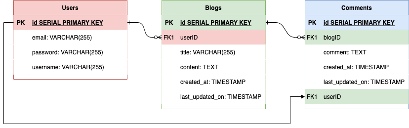
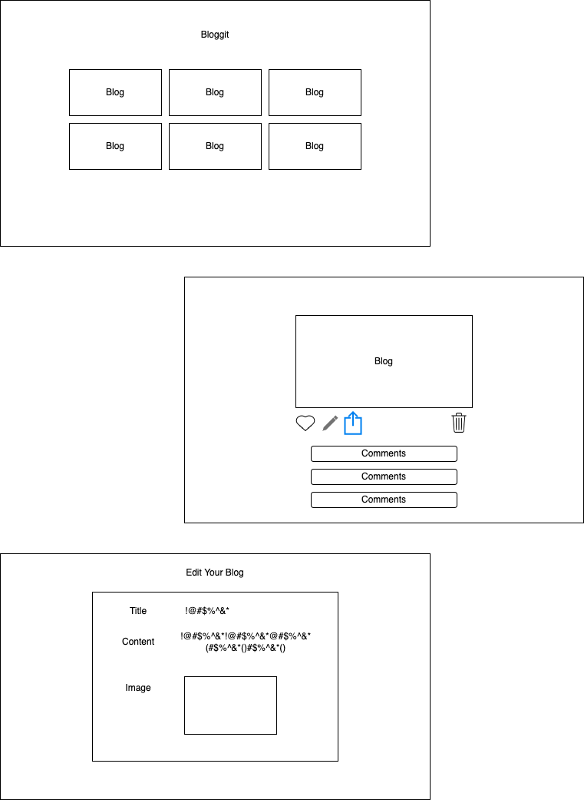

# BloggIt

## Deployed Link

___
## About
BloggIt is a social media blogging website. Create, share, comment, explore!

___
## Goal For Project
My goal is to get more comfortable utilizing Python and Django. As of the start of this project, I don't have any personal works utilizing these two specific technologies. My hope is learn to become a better Python & Django developer through the help of this project.

___
## Installation Instructions
1. Fork and clone the repository
2. Run `pip3 install -r requirements.txt` in your terminal to install dependencies
3. Run `python3 manage.py runserver` in your terminal and go to your browser and type in "localhost:8000"
4. ...

___
## User Stories
- As a user, I want to be able to create a personal account
- As a user, I want to be able to create my own posts
- As a user, I want to be able to add comments and likes on other posts
___

## URL Chart
| Path | Purpose |
| ------ | ---- |
| / | Home Page
| /signup | User registration page 
| /login | User login page 
| /explore | Displays all blogs chronologically from all users
| /blogs | Displays logged in user's blogs
| /blogs/create | Create a blog
| /blogs/:id/ | View page for selected blog - access to blog edit page link / can delete blog / can add comments / access to comment edit page link / can delete comments
| /blogs/:id/edit | Page to edit the selected blog 
| /blogs/:id/edit_comment/:commment_id | Page to edit the selected comment


## Routing Chart
| Method | Path | Purpose |
| ------ | ---- | ------- |
| GET | / | Home page
| GET | /register | Page to create a new user
| POST | /register | Adds new user created to database
| GET | /login | Login Page
| POST | /welcome | Authenticate login information
| GET | /explore | Page with blogs from all users displayed
| GET | /blogs | Page with all blogs displayed
| GET | /blogs/create | Page with template/form to create blog
| POST | /blogs/create | Create a new blog
| GET | /blogs/:id | Page with selected blog's info and comments
| GET | /blogs/:id/edit | Page to edit blog
| PUT | /blogs/:id/edit | Edit a blog
| DELETE | /blogs/:id/delete | Delete a blog
| GET | /blogs/:id/edit_comment/:comment_id | Page to edit a comment
| PUT | /blogs/:id/edit_comment/:comment_id | Edit a comment
| Delete | /blogs/:id/delete_comment/:comment_id | Delete a comment


## ERDs

___

## Wireframes

___
## Final Product Images

___
## Tech Utilized
- PostgreSQL
- Python
- Django
- Bootstrap
___

## MVP Checklist
- [X] Be able to create new users and save in the database
- [X] Be able to create new blogs that save in the database
- [X] Be able to edit and delete own blogs
- [X] Be able to comment on all blogs (user's own blogs and other users' blogs)
- [X] Be able to delete own comments
___

## Stetch Goals
- [ ] Implement a "like" button
- [ ] Implement a "share" button
- [ ] Implement a "follow" feature
- [ ] Implement a DM/chat feature
- [ ] Implement a search feature where you can search blogs by "title" or "hashtags"
___

## Code Highlights
```javascript
```
___

## Resources
- 